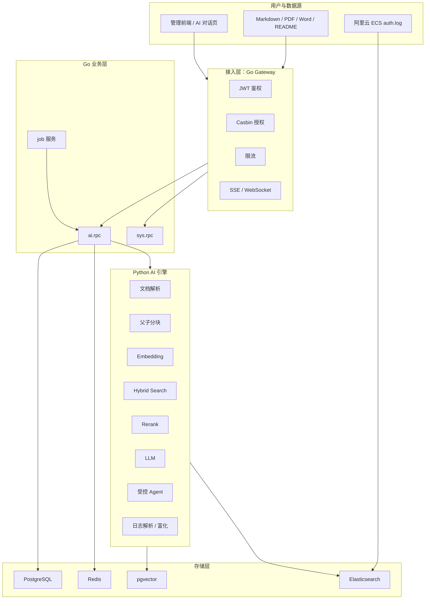
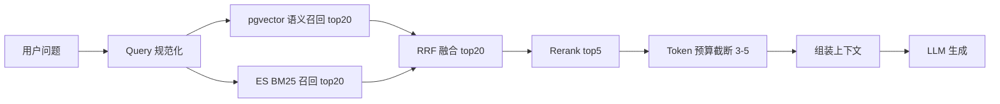
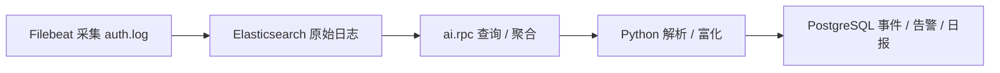

# 开发者 AI 副驾驶平台

基于 Go + Python 的微服务架构 AI 副驾驶平台，包含**知识副驾驶**（RAG 知识库）和**安全副驾驶**（SSH 登录日志分析）两条业务主线，覆盖 RAG、Hybrid Search、Rerank、Agent / Function Calling、LLMOps 等企业级 AI 应用开发核心能力。

## 业务主线

| 方向 | 核心能力 | 典型场景 |
| --- | --- | --- |
| **知识副驾驶** | 文档解析、父子分块、向量召回、BM25 召回、Rerank、引用溯源 | "这个项目怎么部署""某个错误以前怎么解决过" |
| **安全副驾驶** | Filebeat 日志采集、规则引擎告警、AI 安全日报、自然语言查询 | "昨天最可疑的 IP 是谁""今天有没有异常登录" |

## 总体架构



### 分层职责

| 层 | 职责 |
| --- | --- |
| Gateway | 统一入口、JWT 鉴权、Casbin 授权、限流、SSE/WebSocket 流式转发 |
| ai.rpc | 业务编排、状态管理、任务调度、工具注册 |
| Python AI Engine | 文档解析、分块、Embedding、检索、Rerank、LLM 调用、Agent 推理 |
| PostgreSQL | 业务数据、会话、告警、日报 |
| pgvector | 文档向量索引 |
| Elasticsearch | 文档 BM25 关键词召回 + 安全日志全文检索 |
| Redis | 缓存、限流、分布式锁 |

## 技术栈

| 分类 | 技术 | 说明 |
| --- | --- | --- |
| 系统语言 | Go 1.24 | go-zero v1.10 微服务框架 |
| AI 引擎 | Python 3.10+ | FastAPI ASGI + uvicorn |
| 网关 | go-zero rest.Server | JWT + Casbin RBAC + 限流 |
| RPC | gRPC / protobuf | 7 个服务域 |
| 服务发现 | etcd | 服务注册与发现 |
| 数据库 | PostgreSQL | 业务数据存储 |
| 向量库 | pgvector | 文档 Embedding 向量索引 |
| 搜索引擎 | Elasticsearch 9.x | BM25 + 全文检索 |
| 缓存 | Redis | 缓存、限流、分布式锁 |
| 前端 | Vue.js (Vite) | 管理后台 + AI 对话页 |
| 容器化 | Docker + Kubernetes | 全服务 Dockerfile + K8s Manifests |
| 日志采集 | Filebeat | SSH auth.log 采集 |

## 核心特性

### 知识副驾驶 - RAG 检索链路



- **父子分块索引**：子块小负责精准召回，父块大负责提供完整上下文
- **Hybrid Search**：pgvector 语义召回 + ES BM25 关键词召回，双路融合
- **Rerank**：融合后精排，提升最终上下文质量
- **上下文工程**：System Prompt + 短期记忆 + 检索片段 + 用户问题 + 输出格式

### 安全副驾驶 - 日志分析链路



- **规则引擎**：暴力破解（5 分钟同 IP 失败 >= 10 次）、高危 IP、异常地区登录
- **AI 安全日报**：攻击趋势、Top IP、Top 国家、AI 总结、建议动作
- **自然语言查询**："昨天有多少次恶意登录？"

### 受控 Agent

首版只做受控工具调用，不做任意 shell 执行或自治决策：

- 工具白名单：`search_knowledge_base`、`query_security_events`、`query_security_alerts`、`get_daily_report`、`generate_daily_report`
- 安全控制：参数 Schema 校验、权限校验、工具只读、检索隔离、Prompt 注入防护、全链路审计

> LLM 负责建议，系统负责裁决，权限系统拥有最后否决权。

## 项目结构

```text
ai-copilot-platform/
├── gateway/                    # Go HTTP 网关 (go-zero rest.Server)
│   ├── gateway.go              # 入口
│   ├── api/                    # API 定义 (.api 文件)
│   │   └── desc/ai/            # AI 域 API 定义
│   ├── etc/                    # 配置 (yaml gitignored, example 可提交)
│   ├── internal/               # handler / logic / svc / types / middleware
│   └── pkg/                    # sysgateway 注册包 / upload 工具
├── service/
│   ├── ai/
│   │   ├── rpc/                # Go AI RPC 服务 (gRPC)
│   │   │   ├── ai.go           # 入口
│   │   │   ├── pb/             # protobuf 定义 + 生成代码
│   │   │   ├── etc/            # 配置 (yaml gitignored)
│   │   │   └── internal/       # config / logic / server / svc
│   │   └── engine/             # Python AI 引擎 (FastAPI)
│   │       ├── app/            # api / core / schemas / services
│   │       ├── tests/          # 测试
│   │       ├── scripts/        # 冒烟脚本
│   │       ├── requirements.txt
│   │       └── config.example.yaml
│   └── job/                    # Go 定时任务服务
├── deploy/                     # 部署配置
│   ├── docker/                 # Dockerfile + SQL
│   ├── elasticsearch/          # ES 索引模板
│   ├── filebeat/               # Filebeat 配置模板
│   └── k8s/                    # Kubernetes Manifests
├── etc/                        # 通用配置 (Casbin rbac_model.conf)
├── go.work                     # Go workspace
└── go.mod
```

## 快速开始

### 前置依赖

- Go 1.24+
- Python 3.10+
- PostgreSQL + pgvector 扩展
- Elasticsearch 9.x
- Redis
- etcd

### 启动 Python AI 引擎

```bash
cd service/ai/engine
python -m venv .venv
source .venv/bin/activate  # Windows: .\.venv\Scripts\activate
pip install -r requirements.txt
cp config.example.yaml config.yaml  # 修改为实际配置
uvicorn app.main:app --reload --host 0.0.0.0 --port 8001
```

健康检查：

```bash
curl http://127.0.0.1:8001/v1/health
```

### 启动 Go 服务

```bash
# 启动 sys-rpc (依赖 go-zero-rpc 架构仓)
cd <go-zero-rpc>/service/sys/rpc
go run sys.go -f etc/sys.yaml

# 启动 ai.rpc
cd service/ai/rpc
cp etc/ai.example.yaml etc/ai.yaml  # 修改为实际配置
go run ai.go -f etc/ai.yaml

# 启动 Gateway
cd gateway
cp etc/gateway-api.example.yaml etc/gateway.yaml  # 修改为实际配置
go run gateway.go -f etc/gateway.yaml
```

## API 概览

### 对外接口 (Gateway)

```text
知识库
POST   /api/ai/kb                    创建知识库
GET    /api/ai/kb                    知识库列表
POST   /api/ai/document/upload       上传文档
GET    /api/ai/document/:id          文档详情

对话
POST   /api/ai/chat/conversation     创建会话
GET    /api/ai/chat/conversation/:id/messages  消息列表
POST   /api/ai/chat/stream           流式对话

安全
POST   /api/ai/security/logs/ingest  日志入库
GET    /api/ai/security/events       安全事件
GET    /api/ai/security/alerts       安全告警
GET    /api/ai/security/reports/daily AI 日报

平台
GET    /api/ai/models                模型配置
GET    /api/ai/llm-calls             LLM 调用记录
```

### Python 内部接口 (AI Engine)

```text
POST /v1/parse          文档解析
POST /v1/chunk          文档分块
POST /v1/embed          向量化
POST /v1/retrieve       检索
POST /v1/rerank         重排
POST /v1/chat/stream    流式对话
POST /v1/log/enrich     日志富化
POST /v1/summarize      摘要生成
POST /v1/agent/run      Agent 执行
```

## 数据库设计

| 域 | 表 |
| --- | --- |
| 知识域 | `ai_knowledge_base`, `ai_document`, `ai_document_parent_chunk`, `ai_document_chunk` |
| 对话域 | `ai_conversation`, `ai_message` |
| 安全域 | `ai_security_event`, `ai_security_alert`, `ai_daily_report` |
| 平台域 | `ai_model_config`, `ai_llm_call_log` |

ES 索引：`kb_chunks_index`（文档关键词索引）、`security_logs_index`（安全日志全文索引）

## License

MIT License
