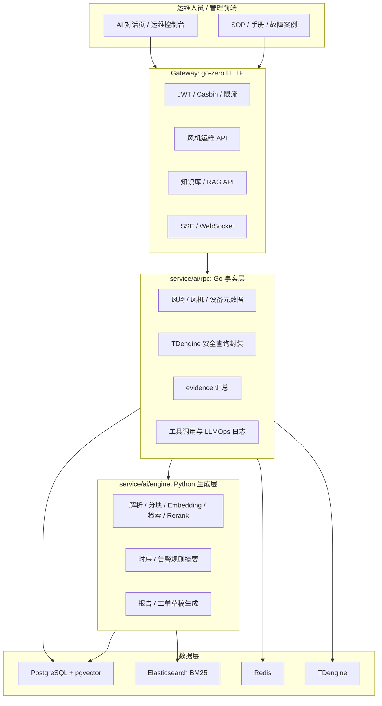

# 风机混塔智能运维 AI Copilot

基于 Go + Python 的风机混塔智能运维 AI Copilot，面向风场运维场景提供运维知识问答、测点时序分析、告警处置、健康报告和工单草稿能力。项目保留原有 RAG 知识库底座，将旧的 SSH 安全分析、AI 安全日报和旧 Agent 占位接口替换为风机混塔运维业务闭环。

核心原则：

```text
Go 管事实和权限，Python 管总结和生成。
```

## 业务目标

运维人员可以用自然语言提出问题，系统只基于可追溯的事实证据生成结构化回答：

- PostgreSQL 中的风场、风机、设备、测点和 AI 草稿数据。
- TDengine 中的测点时序数据和告警事件。
- 知识库中的设备说明书、SOP、验收文档和历史故障案例。
- LLMOps 与 `ai_tool_call_log` 中的工具调用、trace 和 token 日志。

一期先跑通工程闭环：元数据查询、TDengine 查询封装、evidence 汇总、Python 规则模板生成、工具日志留痕。后续再逐步接入更完整的告警归因、SOP 检索、健康报告、故障复盘和 LangGraph Agent 编排。

## 功能模块

| 模块 | 一期能力 | 后续扩展 |
| --- | --- | --- |
| 运维知识副驾驶 | 复用文档入库、父子分块、pgvector + Elasticsearch Hybrid Search、RAG 问答和引用溯源 | SOP 专用检索、历史案例召回、带证据的处置问答 |
| 测点分析副驾驶 | 查询风场/风机/设备元数据，按白名单查询 TDengine 时序数据，生成 points evidence | 多窗口趋势对比、持续超限判断、异常测点排名 |
| 告警处置副驾驶 | 查询 TDengine alarm 数据，按等级、状态、风机聚合，返回归因草稿结构 | 告警前后测点回查、SOP/历史案例检索、归因候选入库 |
| 健康报告副驾驶 | 基于 evidence 生成风场日报、周报、单机报告或故障复盘草稿 | 在线率、缺测率、重复告警、风险趋势和引用报告 |
| Agent 与工单 | 返回 traceId、工具白名单、可编辑工单草稿和工具调用日志 | 意图解析、受控工具编排、自动保存分析结果 |

## 总体架构



### 分层职责

| 层 | 职责 |
| --- | --- |
| Gateway | 统一 HTTP 入口、鉴权、限流、WebSocket/SSE 转发、DTO 转换 |
| Go AI RPC | 权限校验、元数据查询、TDengine 查询、RAG 编排、evidence 汇总、审计日志 |
| Python AI Engine | 文档解析、分块、Embedding、Hybrid Search、规则模板摘要、报告和工单草稿 |
| PostgreSQL | 知识库、会话、LLMOps、风机元数据、报告草稿、工单草稿 |
| TDengine | 风机传感器时序数据与告警超级表 |
| Elasticsearch | 知识库 BM25 关键词召回 |
| Redis | 缓存、限流、分布式锁 |

## 技术栈

| 分类 | 技术 | 说明 |
| --- | --- | --- |
| 后端框架 | Go 1.24 + go-zero | Gateway 与 AI RPC |
| RPC | gRPC / protobuf | AI 服务内部接口 |
| AI 引擎 | Python 3.10+ + FastAPI | RAG、摘要、报告草稿 |
| 业务库 | PostgreSQL | 元数据、知识库、报告与日志 |
| 向量库 | pgvector | 文档向量索引 |
| 搜索 | Elasticsearch | BM25 召回 |
| 时序库 | TDengine | 风机测点和告警数据 |
| 缓存 | Redis | 缓存、限流、分布式锁 |
| 服务发现 | etcd | go-zero 服务注册与发现 |
| 容器化 | Docker / Kubernetes | 部署脚本与清单 |

## 项目结构

```text
ai-copilot-platform/
├── gateway/                         # go-zero HTTP 网关
│   ├── api/desc/ai/                 # AI 域 API 定义
│   │   ├── wind_common.api
│   │   ├── wind_metadata.api
│   │   ├── wind_timeseries.api
│   │   ├── wind_alarm.api
│   │   ├── wind_report.api
│   │   └── wind_agent.api
│   ├── internal/handler/            # HTTP handler
│   ├── internal/logic/              # Gateway 业务转发逻辑
│   └── etc/                         # 本地 yaml 已忽略，example 可提交
├── service/
│   └── ai/
│       ├── rpc/                     # Go AI RPC
│       │   ├── pb/ai.proto          # 知识库、会话、LLMOps、Wind RPC 定义
│       │   ├── internal/model/      # PostgreSQL 与 TDengine 查询封装
│       │   ├── internal/logic/      # AI RPC 业务逻辑
│       │   └── etc/                 # 本地 yaml 已忽略，example 可提交
│       └── engine/                  # Python FastAPI AI Engine
│           ├── app/api/routes_wind.py
│           ├── app/schemas/wind.py
│           ├── app/services/wind.py
│           └── tests/test_wind.py
├── deploy/sql/
│   ├── ai_copilot.sql               # AI 知识库与平台表
│   ├── ai_wind_copilot.sql          # 风机混塔 AI Copilot 表
│   └── wind_data.sql                # 原风机业务数据表重构来源
├── etc/                             # 通用配置模板
├── go.work
└── go.mod
```

## 核心数据设计

### PostgreSQL 风机业务表

| 表 | 作用 |
| --- | --- |
| `wind_farm` | 风场信息与 TDengine database 映射 |
| `wind_turbine` | 风机/混塔元数据 |
| `wind_device_type` | 设备类型与 TDengine stable 映射 |
| `wind_device` | 设备实例、通道和安装位置 |
| `wind_device_meta` | 字段白名单、单位、阈值和测点描述 |
| `wind_structure_type` | 风机结构位置 |
| `wind_model`, `wind_model_device_map`, `wind_model_record` | 模型与设备映射预留 |
| `wind_camera_record` | 摄像机记录预留 |

### AI 草稿与审计表

| 表 | 作用 |
| --- | --- |
| `ai_alarm_analysis` | 告警归因草稿与 evidence |
| `ai_health_report` | 健康报告草稿 |
| `ai_maintenance_ticket_draft` | 可编辑维修工单草稿 |
| `ai_tool_call_log` | 受控工具调用日志 |
| `ai_llm_call_log` | LLM 调用 trace 与 token 统计 |

### TDengine stable 映射

| 数据类型 | stable |
| --- | --- |
| 应变 | `strain` |
| 加速度 | `accel` |
| 倾角 | `inclinometer` |
| 锚索计 | `tension` |
| 测风雷达 | `radar` |
| 测缝计 | `joint_meter` |
| 静力水准仪 | `hydrostatic` |
| 超声波液位 | `ultrasonic_level` |
| GNSS | `gnss` |
| 告警 | `alarm` |

TDengine 查询必须经过 Go RPC model 封装，`database`、`stable` 和 `field` 分别只能来自 `wind_farm.td_database`、`wind_device_type.td_stable` 和 `wind_device_meta.column_name`，前端不能传任意 SQL。

## API 概览

### Gateway 风机运维接口

| 方法 | 路径 | 说明 |
| --- | --- | --- |
| GET | `/api/v1/ai/wind/metadata/farms` | 查询风场列表和 TDengine database 映射 |
| GET | `/api/v1/ai/wind/metadata/turbines` | 查询风机列表 |
| GET | `/api/v1/ai/wind/metadata/devices` | 查询设备、测点和 stable 映射 |
| POST | `/api/v1/ai/wind/timeseries/query` | 查询测点时序数据并返回 evidence |
| POST | `/api/v1/ai/wind/timeseries/compare` | 趋势对比草稿 |
| POST | `/api/v1/ai/wind/alarms/query` | 查询 TDengine alarm 数据 |
| POST | `/api/v1/ai/wind/alarms/analyze` | 告警归因草稿 |
| POST | `/api/v1/ai/wind/reports/health/generate` | 生成健康报告草稿 |
| GET | `/api/v1/ai/wind/reports/health/:reportId` | 查询健康报告草稿 |
| POST | `/api/v1/ai/wind/tickets/draft` | 创建维修工单草稿 |
| POST | `/api/v1/ai/wind/agent/run` | 运行受控 Agent |
| GET | `/api/v1/ai/wind/agent/tool-calls` | 查询工具调用日志 |

### Python Engine 内部接口

| 方法 | 路径 | 说明 |
| --- | --- | --- |
| POST | `/v1/wind/summary/timeseries` | 根据 points evidence 生成测点统计摘要 |
| POST | `/v1/wind/summary/alarm` | 根据 alarm evidence 聚合告警 |
| POST | `/v1/wind/reports/health/draft` | 生成健康报告草稿 |
| POST | `/v1/wind/tickets/draft` | 生成维修工单草稿 |

### Agent 工具白名单

```text
search_maintenance_sop
query_sensor_timeseries
query_alarm_events
get_turbine_metadata
compare_sensor_trend
generate_health_report
create_maintenance_ticket_draft
```

## 快速开始

### 前置依赖

- Go 1.24+
- Python 3.10+
- PostgreSQL + pgvector
- Elasticsearch
- Redis
- etcd
- TDengine，开发期 `TDengine.Link` 可先留空

### 初始化数据库

```bash
psql -f deploy/sql/ai_copilot.sql
psql -f deploy/sql/ai_wind_copilot.sql
```

如需导入原风机业务表参考数据，可结合 `deploy/sql/wind_data.sql` 做迁移或重构。

### 启动 Python AI Engine

```bash
cd service/ai/engine
python -m venv .venv
source .venv/bin/activate  # Windows: .\.venv\Scripts\activate
pip install -r requirements.txt
cp config.example.yaml config.yaml
uvicorn app.main:app --reload --host 0.0.0.0 --port 8001
```

健康检查：

```bash
curl http://127.0.0.1:8001/v1/health
```

### 启动 Go AI RPC

```bash
cd service/ai/rpc
cp etc/ai.example.yaml etc/ai.yaml
go run ai.go -f etc/ai.yaml
```

`etc/ai.yaml` 是本地敏感配置，已被 `.gitignore` 忽略。TDengine 未配置时，相关接口应返回空结果和 scaffold evidence，不影响服务启动。

### 启动 Gateway

```bash
cd gateway
cp etc/gateway-api.example.yaml etc/gateway.yaml
go run gateway.go -f etc/gateway.yaml
```

## 开发命令

重新生成 Gateway：

```powershell
cd D:\GoProject\project_new\ai-copilot-platform\gateway
goctl api go -api api\gateway.api -dir . --style=go_zero
```

重新生成 AI RPC：

```powershell
cd D:\GoProject\project_new\ai-copilot-platform\service\ai\rpc
goctl rpc protoc pb\ai.proto --go_out=. --go-grpc_out=. --zrpc_out=. --style=go_zero -m
```

## License

MIT License
